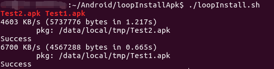
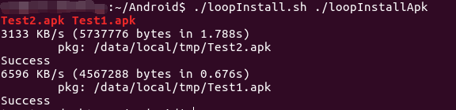

一个安装apk的脚本

可选择多设备安装指定目录下所有的apk

#### e.g.

>./loopInstall.sh

寻找当前目录下所有apk文件并安装，假设当前只链接一台设备，而当前目录分别有`Test1.apk`、`Test2.apk`，如下图：

---

>./loopInstall.sh ./loopInstallApk

寻找当前目录下的子目录`loopInstallApk`下的所有apk文件并安装，入下图：

### 指令

* -a

  安装所有设备，不用选择设备
